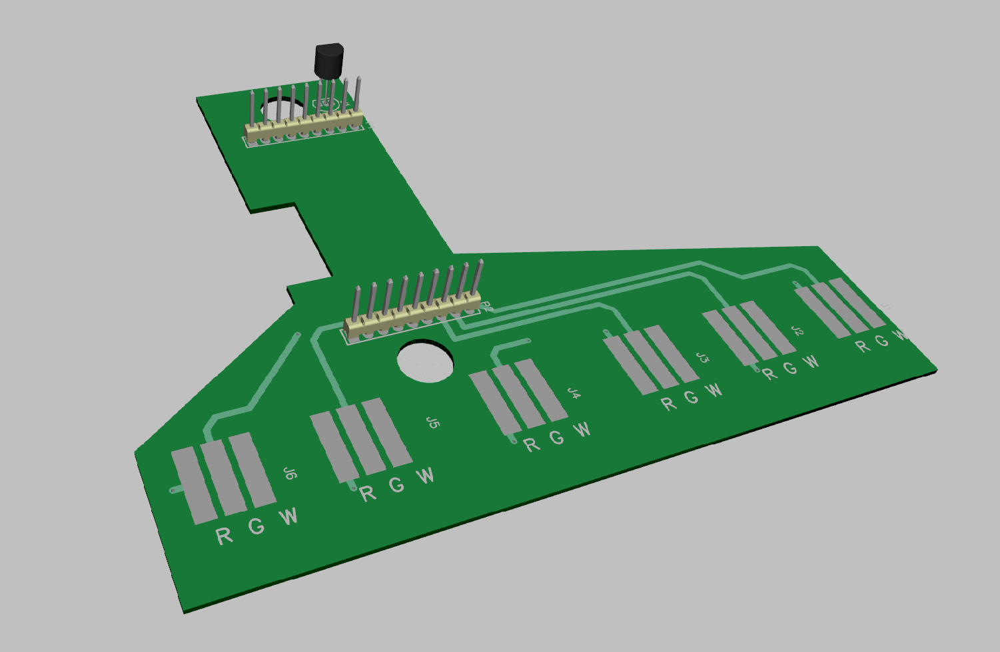

# Six-String-WS2812B-Cape

A PCB very simple board to quickly connect 6 WS2812B strings to a BeagleBone Black or Green. Nothing to break. Only works with 3.3V WS2812B strings, but those are the only ones you should use anyway becuase otherstend to be crappier!

Also includes a place for an optional DS18B20 temp sensor. 

Assembles in 5 minutes. Video here...

https://youtu.be/PlzzqEVQ470

